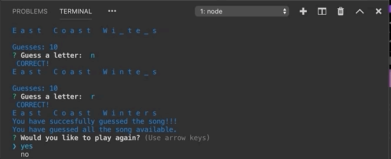

# Command-line-word-guess

This commandLine word guessing game was created to show the usage to Constructors as well as the npm package "inquirer".

In order to get this game running, inquireer is required as well as node must be installed.

This game will allow you to choose there different bands/artists and the game will select 5 random songs (of 10 available) of the selected artist for the player to guess

The game allows 10 guesses per word and will inform the user if they are incorect.  The application will error check to make sure that the letter the user is inputing is both a letter and only one character long.

Because the game allows you to chose 3 different bands/artists and selects 5 songs of the 10 available, there is room for the user to replay the game.  If the user gets through all 5 words, the game will ask if they want to play again.
* if user selects yes, the inital prompt will output
* if user selects no, the game will stop

