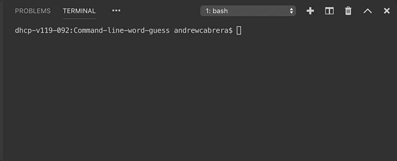

# Command-line-word-guess

This commandLine word guessing game was created to show the usage to Constructors as well as the npm package "inquirer".

In order to get this game running, inquireer is required as well as node must be installed.

This game will allow you to choose there different bands/artists and the game will select 5 random songs (of 10 available) of the selected artist for the player to guess

